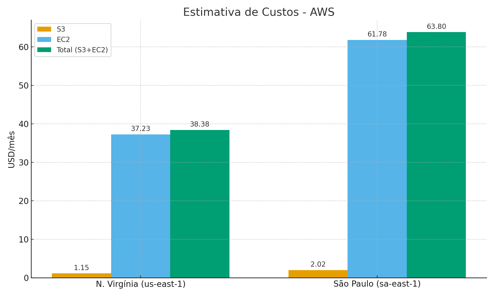

# 🌱 FarmTech Solutions — Fase 5 (FIAP)

## 👤 Integrante
- **Nome:** Robson Alves Costa  
- **RM:** 565066  
- **Curso:** Inteligência Artificial – FIAP  
- **Fase:** 5-SET-2025  

---

## 📌 Introdução
Este repositório contém a entrega da **Fase 5** do curso de Inteligência Artificial da FIAP.  
O projeto foi desenvolvido para a **FarmTech Solutions**, empresa que presta serviços de **IA aplicada ao agronegócio**.  

O desafio consiste em analisar uma base de dados com informações de **condições de solo e clima**, visando:  
1. Prever o **rendimento das safras** (modelos de regressão supervisionada).  
2. Explorar a **tendência de produtividade** com técnicas de aprendizado não supervisionado (clusterização).  
3. Identificar **outliers** e possíveis cenários discrepantes.  
4. Realizar a estimativa de custos de infraestrutura em **nuvem AWS** para hospedar a solução.  

---

## 📂 Estrutura do Repositório
- 📓 **`RobsonCosta_rm565066_pbl_fase4.ipynb`** → Notebook Jupyter **executado**, contendo:
  - Análise Exploratória de Dados (EDA)  
  - Clusterização (KMeans + PCA)  
  - Detecção de Outliers (Isolation Forest)  
  - Cinco modelos de regressão supervisionada  
  - Validação cruzada e hold-out  
  - Diagnósticos: resíduos e importância das variáveis  

- 📄 **`README.md`** → Este documento introdutório, com explicação geral do projeto e instruções.  

- 📦 **`requirements.txt`** → Dependências necessárias para rodar o notebook localmente.  

- 🖼️ **`aws_ec2_vs_s3_comparacao.png`** → Gráfico comparativo dos custos AWS ( nas regiões N. Virgínia e São Paulo).  

## 🚀 Como Executar o Notebook
### Opção 1 — Google Colab
1. Faça o upload do arquivo `RobsonCosta_rm565066_pbl_fase4.ipynb` no Colab.  
2. Faça upload do dataset `crop_yield.csv` na mesma pasta.  
3. Execute todas as células em ordem.  

### Opção 2 — Local (Jupyter Notebook ou VSCode)
1. Clone este repositório:  
   ```bash
   git clone https://https://github.com/rbncosta
   cd RobsonCosta_FIAP_RM565066_fase5
   ```
2. Instale as dependências:  
   ```bash
   pip install -r requirements.txt
   ```
3. Coloque o arquivo `crop_yield.csv` no diretório raiz.  
4. Abra o notebook em Jupyter/VSCode e execute as células.  

---

## 📊 Entregáveis
### Entrega 1 — Machine Learning
- Notebook Jupyter (`.ipynb`) executado e comentado.  
- Relatório em Markdown dentro do notebook.  
- Análise de EDA, clusterização, outliers e predição com 5 modelos.  
- Métricas de desempenho + diagnósticos finais.  
- Link dos vídeos demonstrativos.

---

## ▶️ Demonstração em Vídeo - Notebook
O vídeo demonstra a execução do notebook, os principais resultados obtidos e a justificativa das escolhas de modelos.

🔗 [Clique aqui para assistir ao vídeo do Notebook no YouTube](https://youtu.be/FL-xDdnsxSU)

---

### Entrega 2 — Computação em Nuvem (AWS)
Simulação de custos na **AWS Pricing Calculator** para estimar os gastos mensais ao hospedar a solução de Machine Learning em nuvem com a seguinte configuração:  

- 2 CPUs  
- 1 GiB de memória  
- Até 5 Gigabit de rede  
- 50 GB de armazenamento

---

  ## ▶️ Demonstração em Vídeo - Estimativa AWS
O vídeo demonstra a execução da estimativa de custos na calculadora da AWS.

🔗 [Clique aqui para assistir ao vídeo da Estimativa no YouTube](https://youtu.be/4Olpto5PEUg)

---

#### 💲 Resultados
- **N. Virgínia (us-east-1):** ~US$ 38,38/mês  
- **São Paulo (sa-east-1):** ~US$ 63,80/mês  

- **O gráfico apresenta a comparação dos valores entre as regiões N. Virgínia x São Paulo**

[](aws_ec2_vs_s3_comparacao.png)

#### 📊 Justificativa da Escolha
- **Custo:** N. Virgínia é cerca de ~40% mais barato.  
- **Latência:** São Paulo oferece menor latência para os sensores e usuários brasileiros.  
- **Legalidade:** Há exigências legais, como por exemplo LGPD que podem obrigar o armazenamento dos dados dentro do país. 

#### ✅ Decisão Final
Apesar do custo mais baixo em N. Virgínia, a opção mais adequada é hospedar em **São Paulo (sa-east-1)**, pois garante conformidade legal, menor latência e maior confiabilidade para os dados.

---

## ⚠️ Observações
- O repositório foi entregue com todas as células do notebook **executadas**, para garantir transparência na correção.  

---

## 📌 Em resumo
- Este README conduz o avaliador até o **notebook Jupyter**, onde está todo o passo a passo detalhado e descrito em Markdown sobre a análise exploratória, clusterização, modelagem e avaliação de desempenho.
- Além disso, a seção da **Entrega 2** apresenta a **estimativa de custos na AWS** com base em diferentes regiões (N. Virgínia e São Paulo), incluindo o gráfico comparativo e uma justificativa clara da escolha mais adequada para hospedar a solução de Machine Learning.
